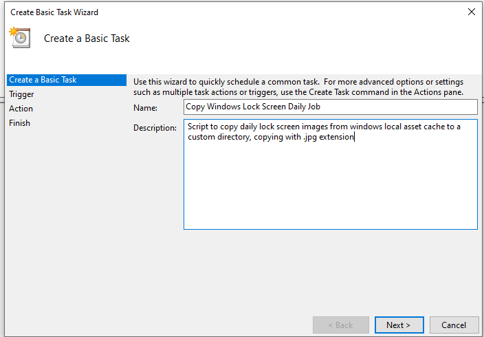
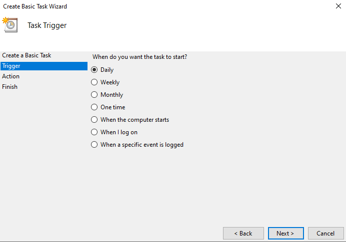
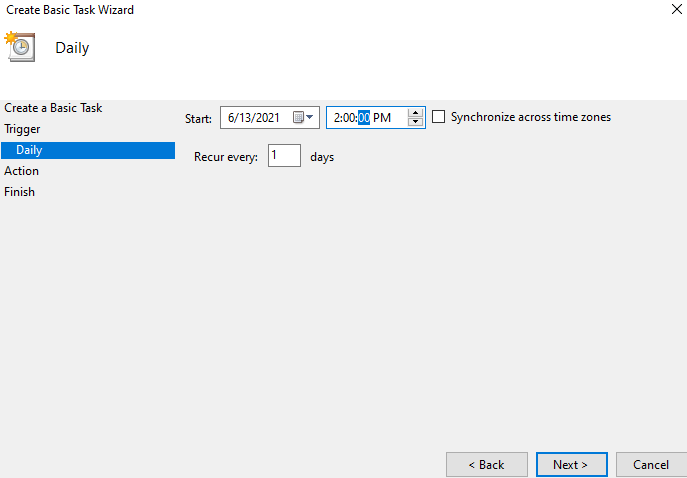
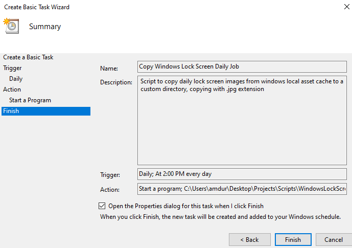
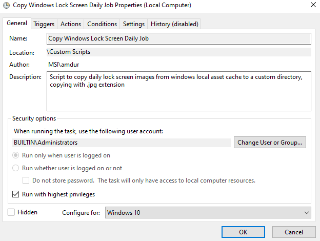
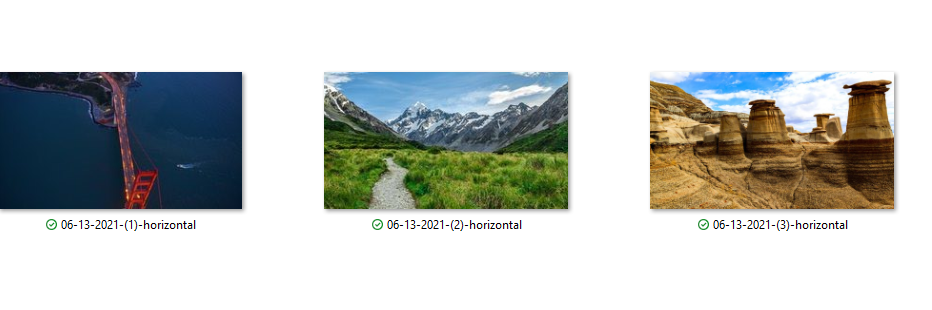
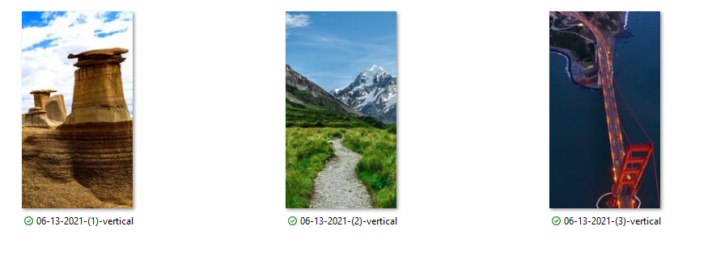

# Windows Lock Screen Image Copy Job
Script to copy images from Microsoft's temporary daily content delivery asset data.
## Purpose
Microsoft publishes some cool windows lock screen images, but its not obvious how to get them. This script allows one to copy the daily images downloaded for the lock screen and move them to a custom folder. Schedule a task in windows task scheduler to automatically build your background image collection.

## About
**CopyDailyWindowsLockScreenPhotos.ps1** script searches the windows content folder for files created the day the script is run, greater than 400kb. It checks the dimensions of the images (vertical and horizontal images are provided daily), and copies those files to the specified target directory, placing the images in a horizontal and vertical images folder respectively.

Copied images will be named [MM-DD-YYYY]-[#]-[horizontal/vertical]
## Usage
```
powershell CopyDailyWindowsLockScreenPhotos.ps1 [targetDirectory]
 ```
Takes one argument [targetDirectory], which is the folder to write the images to.
Once the script runs, it will create two folders, **horizontal** for horizontal images, and **vertical** for vertical images and copy the files to the respective directory based on the width dimension.

## Creating a Daily Job using Task Scheduler
For maximum benefit, consider using Task Scheduler to run this script daily to build your background collection.
### Example Job Creation
1. Search for 'Task Scheduler'
2. Click Action -> 'Create Basic Task'
	2a. Optionallly, right click on 'Task Scheduler Library' and create a new folder for your custom script.
	2b. Right click on your folder, select 'Create Basic Task'
3. Fill in Name/Description
4. Select 'Daily' or 'When I Log on' for job timing
5. Select the time to run the job, I chose a time I normally have logged in by.
6. Select 'Start a program'
	6a. Type 'powershell.exe' as the program
	6b. In the 'Add arguments' section, add the absolute path to the script file and the absolute path to the target folder
	**Example:**
	```
	C:/users/myuser/scripts/CopyDailyWindowsLockScreenPhotos.ps1 C:/users/myuser/photos
	```
	Note the space between, the first item is the path to the script, the second is the path to the target folder
7. Click Finish (select Open the properties dialog)
8. In the properties dialog, make sure to run as the **Admin** for your computer, your configuration may be different
9. Select Run with highest privileges', configure for windows 10.
10. Job will now run daily at the scheduled time.

Images of the following:















## Considerations
I'm not sure when these files are downloaded exactly, but based on the timestamps, I'm assuming it's when the user wakes up the computer. Feel free to investigate/play around with the job timing.

